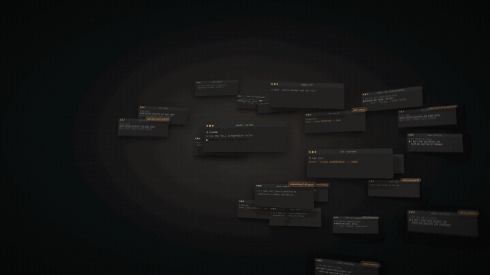
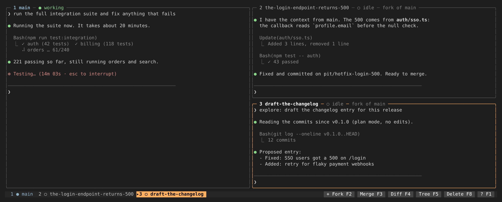
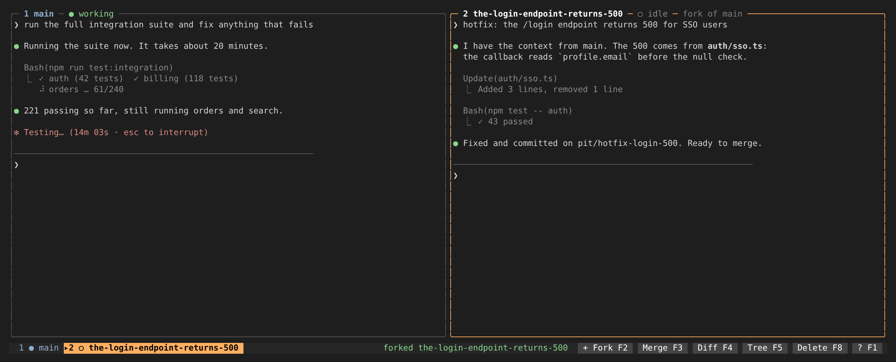
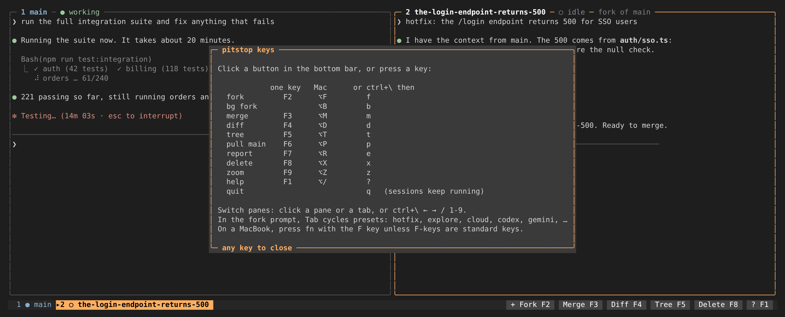
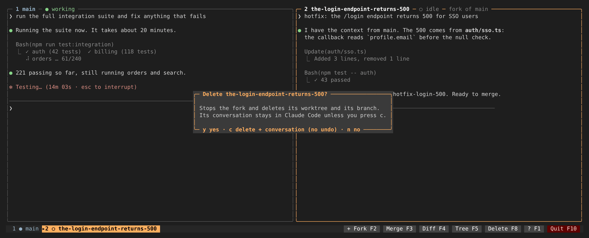

<div align="center">

# pitstop

**Branch a running Claude Code session the way you branch code, without leaving your terminal.**

[](https://github.com/gowtham012/pitstop/actions/workflows/ci.yml)
[](LICENSE)


<a href="docs/assets/pitstop-launch.mp4"></a>

**[▶ Watch the 50-second launch video (with sound)](docs/assets/pitstop-launch.mp4)**

</div>

Your main Claude session is twenty minutes into a long task when something urgent comes up. Press **F2** (or click **+ Fork**) and type the task:

- A fork with the **full conversation** opens next to the main session, in **its own git worktree**, and both keep running.
- When it's done, **F3** (or **Merge**) brings the code back safely and **tells the main session what changed**.



## Contents

- [How it works](#how-it-works)
- [What you get](#what-you-get)
- [Install](#install) · [Getting started guide](docs/guide.md)
- [Keys and commands](#keys-and-commands)
- [Cloud forks and other agents](#cloud-forks-and-other-agents)
- [Report](#report)
- [Configuration](#configuration)
- [Safety](#safety)
- [Contributing](#contributing)

## How it works

### 1. One terminal, split in two

Start `pit` instead of `claude`. The terminal splits only when you fork. Every session keeps running, and focus only decides which pane gets your keystrokes.



Over time, it looks like this:

- The main session never pauses.
- The fork copies its context without touching it.
- The update reaches main after its next tool call, without you typing anything.


### 2. The conversation branches like a git branch

Every message in a Claude Code transcript points to its parent, so a session is a tree you can branch from. The fork gets everything up to the last complete turn, then your task.


### 3. Forking a busy session safely

Claude Code's own fork of a session that is in the middle of a tool call **runs that call again** (we checked; see [docs/spike.md](docs/spike.md)). For a busy session, pitstop makes a **sealed copy** instead:

- It reads the transcript read-only, up to a fixed length.
- It closes the pending call with "this was the parent's job, don't retry it".
- It ends the copy on a finished turn.

The running session is never written to, locked or paused.


### 4. The code branches without touching your files

The fork's worktree starts from a **snapshot of your uncommitted work**, untracked files included. The snapshot is built with a throwaway git index, so the main session's files and staging are never touched.

At merge time, only the fork's own commits come back, and pitstop picks the safe way to apply them:

- a merge commit if main's tree is clean;
- unstaged changes if main is editing other files;
- otherwise it leaves the branch ready and tells main how to merge it at a good moment.


### 5. What talks to what

Main and every Claude fork are native Claude Code background sessions, so quitting `pit` doesn't stop them. pitstop hosts each one in a pane (`claude attach`). Its hooks travel with each session through `--settings`, so your Claude settings are never edited.


## What you get

Claude Code already ships `/fork`, background sessions, worktrees and cross-session messages, and pitstop builds on them. Here is what it adds:

|                                               | Claude Code today               | pitstop                                                        |
| --------------------------------------------- | ------------------------------- | -------------------------------------------------------------- |
| Fork with the full conversation               | ✅ `/fork`                      | ✅ uses it, plus a **sealed copy** for busy sessions           |
| Several sessions live, side by side           | one at a time, fullscreen       | ✅ **split panes**, tabs past three forks                      |
| Your uncommitted work in the fork             | the fork starts from the branch | ✅ snapshot of your working tree                               |
| Fork stays out of the main checkout           | asked to                        | ✅ **write guard** hook                                        |
| Merge into a branch that's still being edited | pushes a branch, opens a PR     | ✅ commit, apply or defer, one at a time, with a **test gate** |
| Main session told what changed                | if the fork sends a message     | ✅ always, after its next tool call                            |
| Two sessions editing the same file            | not detected                    | ✅ **conflict radar**                                          |
| Branch tree, forks of forks, cost per branch  | flat list                       | ✅ `pit tree`, `pit report`                                    |
| Fork to the cloud or to Codex or Gemini       | separate tools                  | ✅ same keys, same merge                                       |

## Install

pitstop isn't on npm yet, so install it from source:

```bash
git clone https://github.com/gowtham012/pitstop.git
cd pitstop
npm install        # dependencies + build
npm install -g .   # puts `pit` on your PATH
pit doctor         # checks claude, background sessions and the terminal layer
```

Then, in any repo:

```bash
cd your-repo
pit            # starts (or reopens) the main session; extra flags are passed to claude
```

Requirements:

- macOS or Linux, Node 20+, git, and Claude Code with background sessions (`claude agents`). Tested with Claude Code 2.1.292.
- On Linux, `node-pty` compiles during install, so you need `python3`, `make` and `g++`.

**pitstop keeps itself up to date.** Once a day it checks for a new version and installs it in the background; the next `pit` tells you what changed. It never touches a clone with local changes or commits, and `"autoUpgrade": false` in `~/.pitstop/config.json` turns it off. `pit upgrade` updates right away.

**New to pitstop? Read the [getting started guide](docs/guide.md).** It walks through installing, your first fork and merge, presets, repo setup, troubleshooting and uninstalling.

## Keys and commands

Click a button in the bottom bar, or press one key. Every action needs at most two keys:

| Action                                                                              | One key | Mac | or `ctrl+\` then |
| ----------------------------------------------------------------------------------- | ------- | --- | ---------------- |
| **Fork** the focused session into a new pane (Tab in the prompt cycles presets)     | F2      | ⌥F  | `f`              |
| Fork into the **background** (no pane)                                              |         | ⌥B  | `b`              |
| **Merge** a fork back                                                               | F3      | ⌥M  | `m`              |
| Open the fork's **diff** in a pane                                                  | F4      | ⌥D  | `d`              |
| Branch **tree** with state, files, cost and overlaps (`c` clears finished forks)    | F5      | ⌥T  | `t`              |
| **Pull** main's latest commits into the fork                                        | F6      | ⌥P  | `p`              |
| Write a shareable **report**                                                        | F7      | ⌥R  | `e`              |
| **Delete** a fork (`c` deletes its conversation too)                                | F8      | ⌥X  | `x`              |
| **Zoom** the focused pane and back                                                  | F9      | ⌥Z  | `z`              |
| **Help**                                                                            | F1      | ⌥/  | `?`              |
| **Resume** a stopped pane, or re-attach a detached one (or click its bottom border) |         |     | `r`              |
| **Quit**. Claude sessions keep running; `pit` brings the same panes back            | F10     |     | `q`              |

- **Exit:** press F10 twice, or click **Quit** and press Enter.
- **Resume:** quitting never stops your sessions, and `pit` reopens the same panes. If they did stop (a reboot, a crash), `pit` continues main's last conversation and every fork that had a pane, each in its own worktree. `pit resume <name>` continues one fork, and `pit --new` starts a fresh main instead.
- **Switch panes:** click a pane or a tab in the bottom bar, or `ctrl+\` `←` `→` / `1`–`9`.
- **MacBook:** hold `fn` with the F key, unless your keyboard is set to use F1, F2… as standard keys. The ⌥ keys work in Terminal and iTerm2 with their default settings.
- Turn off the one-step keys with `"shortKeys": false`. `ctrl+\` is never bound by Claude Code; pressing it twice sends it to the pane, and `prefixKey` changes it.



Deleting asks first, and only deletes the conversation if you press `c`:



Everything also works from scripts or a second terminal:

```bash
pit fork "fix the login 500"                    # a running pit opens a pane for it
pit fork --bg --preset hotfix "bump next to 15"
pit fork --cloud "run the slow migration"       # asks before pushing
pit fork --agent codex "add a health check"     # asks before sending a summary
pit tree                                        # or: pit status
pit log fix-the-login-500
pit diff fix-the-login-500
pit merge fix-the-login-500                     # --strategy commit|apply|defer|pr, --keep, --skip-tests
pit pull fix-the-login-500
pit delete fix-the-login-500                    # or: pit rm; --conversation deletes its chat too
pit delete --finished                           # clear merged and deleted forks from the history
pit report --out - | gh pr create --body-file -
```

## Cloud forks and other agents

The presets `cloud`, `codex` and `gemini` are built in. Pick one with Tab in the fork prompt, or type `cloud: <task>`.

> [!NOTE]
> Claude Code can't send a local conversation into a cloud session, and Codex or Gemini CLI can't load a Claude transcript. So these forks start from a **summary of the conversation**: what you asked, what Claude said, and one line per command it ran. Only Claude forks on your machine get the full conversation.

**Cloud forks** (`claude --cloud`):

- Need an `origin` remote on GitHub that your Claude GitHub connection can push to.
- pitstop pushes the fork's starting point, **including your uncommitted changes**, to `pit/<name>`, after asking.
- The cloud session pushes its work back to that branch, and the fork shows as ready.
- Merging fetches the branch and works like any other merge. Use `--from <branch>` if the session had to push somewhere else.

**Agent forks** (Codex, Gemini CLI, or any CLI you configure):

- The agent runs in a pane inside the fork's own worktree.
- The first time a repo sends a summary to an agent, pitstop asks, because the summary goes to that provider.
- Merging, the test gate, the radar and the report work the same.
- There's no write guard, because other agents don't run pitstop's hooks.
- Agent panes stop when `pit` quits and resume next time.

```json
{
  "agents": {
    "codex": {
      "cmd": "codex",
      "args": [],
      "resumeArgs": ["resume", "--last"],
      "provider": "OpenAI"
    },
    "gemini": {
      "cmd": "gemini",
      "args": ["-i"],
      "resumeArgs": ["--resume", "latest"],
      "provider": "Google"
    }
  }
}
```

## Report

`pit report`, or F7 in the split screen, writes a summary of every fork, including merged and deleted ones. For each fork it shows:

- the task and where it ran;
- the result and why;
- the test gate result;
- commits, changes and estimated cost;
- the fork's last message.

It also includes the branch tree and any files two sessions are both changing.

Output options:

- Markdown by default.
- `--html` writes a self-contained page.
- `--out -` prints it, for example straight into a PR description.

## Configuration

`~/.pitstop/config.json` holds your settings. `<repo>/.pitstop.json` holds the repo's, and merges on top:

```json
{
  "test": "npm test",
  "testGate": true,
  "setup": { "copy": [".env"], "symlink": ["node_modules"], "run": "npm ci --prefer-offline" },
  "presets": {
    "hotfix": {
      "model": "sonnet",
      "effort": "medium",
      "permissionMode": "acceptEdits",
      "budgetUsd": 2,
      "testGate": true
    }
  },
  "maxSessions": 6,
  "visibleForks": 3,
  "merge": { "mode": "local" },
  "prefixKey": "ctrl+\\"
}
```

- **Ports:** each fork gets `PITSTOP_PORT_OFFSET` (100, 200, …) and `PITSTOP_BRANCH`. Use them in your dev and test config so forks don't collide.
- **Budgets:** Claude Code can't cap a background session's spend, so pitstop stops a fork whose estimated cost passes its preset's `budgetUsd`.
- **Session cap:** `maxSessions` counts main plus forks. They all share your account's rate limits.
- **Updates:** `autoUpgrade` (default `true`, only read from your own config) installs new versions in the background once a day.

## Safety

- **A repo's `.pitstop.json` is treated as untrusted:**
  - its `test`, `setup.run` and `agents` commands are ignored until you run `pit trust`, and asked about again if they change;
  - its presets can only use the `plan`, `manual` or `acceptEdits` permission modes;
  - setup paths must stay inside the repo.
- **Text a fork controls is escaped:** file names, messages and test output are sanitized before they reach another session's context or your terminal.
- **The write guard is a guardrail, not a sandbox.** It covers file tools and the usual shell and git escapes. Use Claude Code's sandbox if you need hard isolation. See [SECURITY.md](SECURITY.md) for how to report a vulnerability.

Known limits:

- Cost figures are estimates, and aren't tracked for cloud and agent forks.
- Sealed copies depend on Claude Code's transcript format, which pitstop reads leniently.
- Cloud and agent forks start from a summary.
- Codex and Gemini support is tested against a stand-in. Reports from real use are welcome.

## Contributing

Issues and pull requests are welcome. See [CONTRIBUTING.md](CONTRIBUTING.md) for setup, the ground rules and how tests work; no Claude account is needed, because the tests use a fake `claude`. [docs/architecture.md](docs/architecture.md) maps the code, and [docs/spike.md](docs/spike.md) records what was verified against Claude Code.

```bash
npm install && npm test
```

## License

[MIT](LICENSE)
